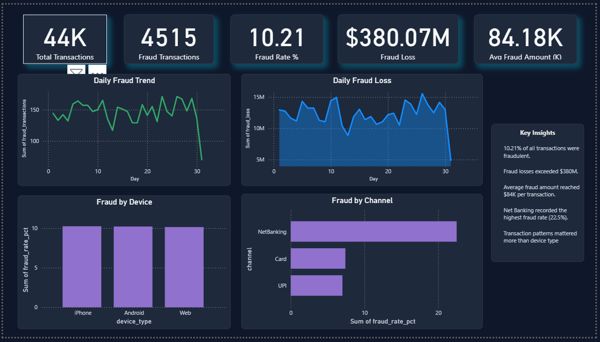
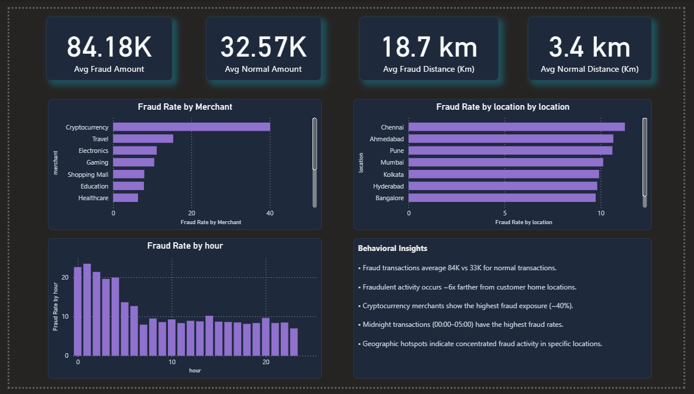
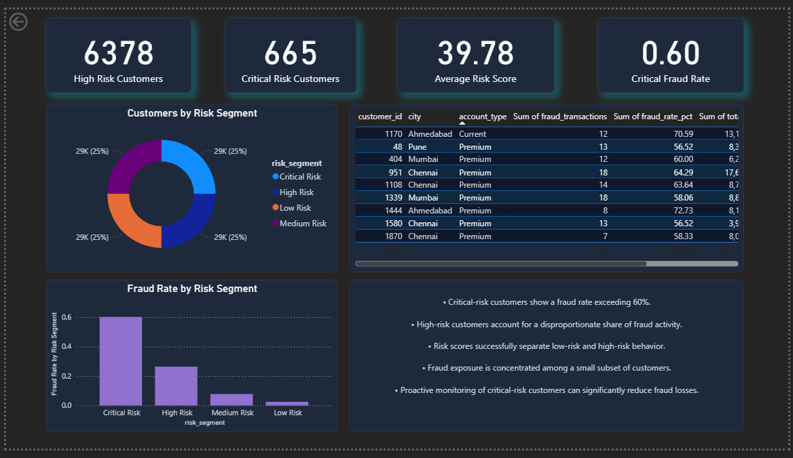
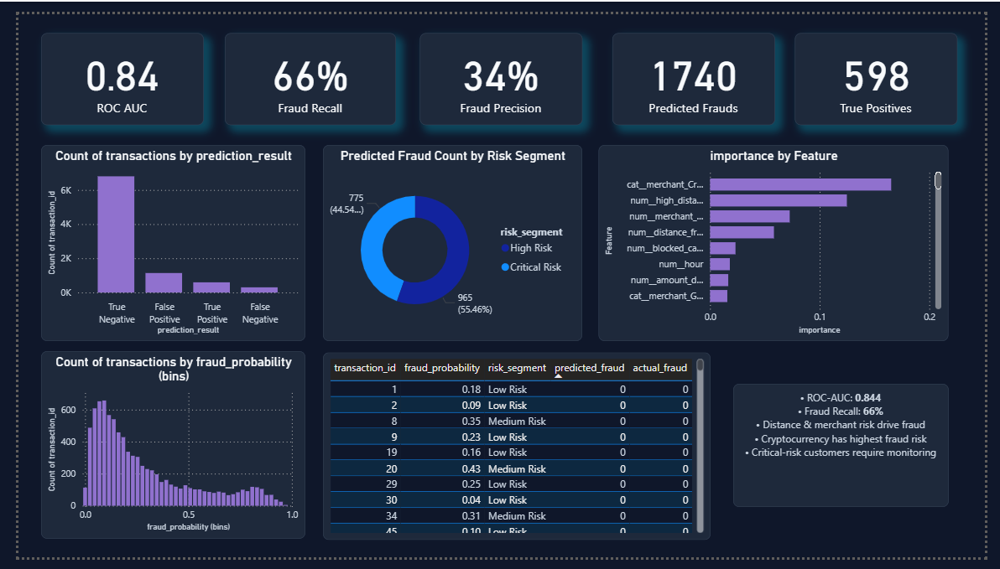

# Banking Fraud Detection & Transaction Risk Analytics

An end-to-end analytics and machine learning solution for detecting fraudulent banking transactions, monitoring customer risk, and supporting fraud investigation teams through SQL analytics, behavioral risk scoring, predictive modeling, and Power BI dashboards.

---
git add README.md
## Project Overview

This project simulates a digital banking fraud detection system built around four layers:

1. SQL Analytics
2. Behavioral Risk Scoring
3. Machine Learning Fraud Detection
4. Executive Power BI Dashboards

The objective is to identify fraud patterns, quantify financial exposure, prioritize high-risk customers, and support operational decision-making.

---

## Project Workflow

```text
Business Problem
        ↓
SQL Analytics
        ↓
Risk Scoring Framework
        ↓
Behavioral Analytics
        ↓
Fraud Detection ML
        ↓
Power BI Dashboards
        ↓
Business Recommendations
```

---

## Dataset

The project uses three core tables:

### Customers

* customer_id
* age
* income
* city
* account_type
* join_date

### Cards

* card_id
* customer_id
* card_type
* credit_limit
* status

### Transactions

* transaction_id
* customer_id
* amount
* merchant
* channel
* device_type
* transaction_time
* location
* distance_from_home
* is_fraud

### Dataset Summary

| Metric             | Value  |
| ------------------ | ------ |
| Customers          | 2,000  |
| Cards              | 2,801  |
| Transactions       | 44,217 |
| Fraud Transactions | 4,515  |
| Fraud Rate         | 10.21% |

---

## SQL Analytics

SQL Server was used to perform fraud analytics and create Power BI source views.

### Key Analyses

* Fraud KPIs
* Customer risk analysis
* Merchant risk analysis
* Channel risk analysis
* Device risk analysis
* Geographic fraud patterns
* Time-based fraud patterns
* Transaction velocity analysis
* Fraud loss analysis

### Key Findings

#### Merchant Risk

| Merchant       | Fraud Rate |
| -------------- | ---------- |
| Cryptocurrency | 40.10%     |
| Travel         | 15.34%     |
| Electronics    | 11.14%     |
| Gaming         | 10.51%     |

#### Channel Risk

| Channel    | Fraud Rate |
| ---------- | ---------- |
| NetBanking | 22.50%     |
| Card       | 7.41%      |
| UPI        | 7.01%      |

#### Behavioral Patterns

| Metric                 | Normal | Fraud   |
| ---------------------- | ------ | ------- |
| Avg Amount             | 32.57K | 84.18K  |
| Avg Distance From Home | 3.4 km | 18.7 km |

#### High-Risk Time Window

Fraud rates were highest between **00:00 and 05:00**, peaking at **23.44%** around 01:00 AM.

---

## Risk Scoring Framework

A custom behavioral risk engine was developed to score every transaction using:

* Amount Risk
* Merchant Risk
* Distance Risk
* Time Risk
* Device Risk

Transactions were classified into four operational risk bands.

| Risk Segment  | Customers | Fraud Rate |
| ------------- | --------- | ---------- |
| Low Risk      | 13,900    | 2.51%      |
| Medium Risk   | 21,952    | 7.81%      |
| High Risk     | 7,640     | 26.39%     |
| Critical Risk | 725       | 60.14%     |

The framework successfully isolated highly vulnerable customers, with the Critical Risk segment showing a fraud rate above 60%.

---

## Machine Learning

Several models were evaluated:

* Logistic Regression
* Random Forest
* Isolation Forest
* XGBoost

### Selected Model: XGBoost

| Metric           | Value |
| ---------------- | ----- |
| ROC-AUC          | 0.844 |
| Recall           | 66%   |
| Precision        | 34%   |
| Predicted Frauds | 1,740 |
| True Positives   | 598   |

### Top Predictive Features

1. Cryptocurrency Merchant
2. High Distance Flag
3. Merchant Risk Score
4. Distance From Home
5. Blocked Card Status
6. Transaction Hour
7. Amount Deviation
8. Gaming Merchant
9. Food Delivery Merchant
10. Night Transaction Flag

---

## Power BI Dashboards

### Page 1 – Fraud Overview & Financial Impact

**KPIs**

* Total Transactions
* Fraud Transactions
* Fraud Rate
* Fraud Loss
* Average Fraud Amount



---

### Page 2 – Behavioral Analytics

**KPIs**

* Average Fraud Amount
* Average Normal Amount
* Average Fraud Distance
* Average Normal Distance



---

### Page 3 – Risk Monitoring & Segmentation

**KPIs**

* High Risk Customers
* Critical Risk Customers
* Average Risk Score
* Critical Segment Fraud Rate



---

### Page 4 – Machine Learning Monitoring

**KPIs**

* ROC-AUC
* Recall
* Precision
* Predicted Frauds
* True Positives



---

## Business Insights

* Cryptocurrency transactions exhibit the highest fraud exposure (40.1% fraud rate).
* NetBanking transactions are over 3x riskier than Card and UPI transactions.
* Fraudulent transactions are 2.6x larger than normal transactions.
* Fraud transactions occur approximately 6x farther from customer home locations.
* Midnight transactions (00:00–05:00) show the highest fraud concentration.
* Critical-risk customers account for a disproportionate share of fraud activity.

---

## Technology Stack

* SQL Server
* Python
* Pandas
* NumPy
* Scikit-Learn
* XGBoost
* Power BI
* Matplotlib

---

## Project Outcomes

This project demonstrates a complete fraud analytics workflow covering:

* SQL-based fraud analysis
* Behavioral risk scoring
* Fraud prediction using machine learning
* Executive dashboard development
* Actionable fraud prevention insights

The final XGBoost model achieved a ROC-AUC of 0.844, while the custom risk scoring framework isolated a Critical Risk segment with a fraud rate exceeding 60%.
